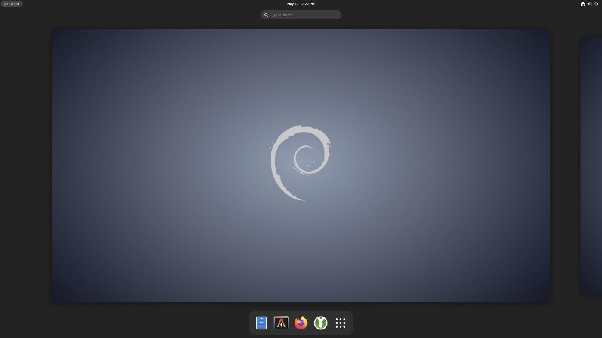
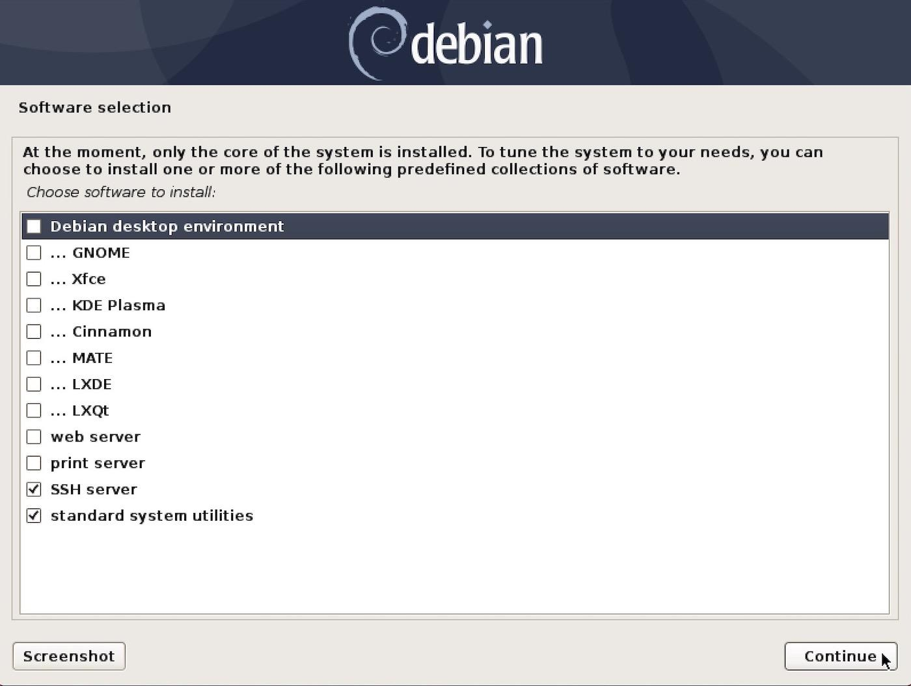

## Debian Gnome Minimal Install Guide

A minimal installation of Linux can reduce disk space and RAM usage, increase security and privacy by reducing attack surface. Increase performance by reducing time spent upgrading and troubleshooting.

The standard Debian installation process for Gnome desktop includes additional packages that may not be necessary or wanted by many users. This guide will allow you to install a minimal Gnome desktop, adding additional packages as needed.

## Requirements

* A debian installation (hardware or virtual machine) with appropriate video drivers.

* sudo privileges to install packages and run optional scripts.

* Installation of `git` to clone this repo `sudo pkg install git`

* Installation of `bash` to run install script `sudo pkg install bash`

## ISO for Installing Debian

* [debian-12.5.0-amd64-netinst.iso](https://cdimage.debian.org/debian-cd/current/amd64/iso-cd/debian-12.5.0-amd64-netinst.iso)
* [Installing Debian 12.5](https://www.debian.org/releases/bookworm/debian-installer/)
* [Debian “bookworm” Release Information](https://www.debian.org/releases/bookworm/)

## Installing Debian without a desktop environment

As you progress through the debian installation, towards the end you will be presented with the following screen for Software selection:



Uncheck **Debian desktop environment** to install a minimal debian system.

## Update sources to testing or unstable (optional)

Update sources to `bookworm.` The current testing branch.

`sudo $EDITOR /etc/apt/sources`:

```bash
deb http://deb.debian.org/debian bookworm main
deb-src http://deb.debian.org/debian bookworm main

deb http://deb.debian.org/debian-security/ bookworm-security main
deb-src http://deb.debian.org/debian-security/ bookworm-security main

deb http://deb.debian.org/debian bookworm-updates main
deb-src http://deb.debian.org/debian bookworm-updates main

# deb http://deb.debian.org/debian bookworm-backports main
# deb-src http://deb.debian.org/debian bookworm-backports main
```

Add `contrib non-free` after each `main` entry if you need special drivers or additional firmware.

The other option would be debian `unstable` (sid). Update `sources` as follows:

```bash
deb http://deb.debian.org/debian/ unstable main
deb-src http://deb.debian.org/debian/ unstable main
```

Upgrade your system:

```bash
sudo apt update && apt upgrade
```

Reboot to load updated kernel and services.

## Quick Install Minimal Gnome

```bash
# clone the repo
git clone https://github.com/coonrad/Debian-Gnome-Minimal-Install.git
# cd to repo
cd Debian-Gnome-Minimal-Install
# run install script and call the gnome function
./install-debian gnome
reboot
```
The minimal gnome package list will install gdm (login manager), and once you reboot you should have a fully functional minimal gnome installation.

The simple script will take the command line argument (in this case 'gnome') and match it to the function to install the selected gnome related packages. (It also verifies you are running Debian before doing anyhting.) You can add or subtract packages to suit your needs. (gnome-session is required.)

```bash
#!/usr/bin/env bash

set -e

gnome() {
    sudo apt install -y \
        eog \
        evince \
        gnome-calculator \
        gnome-disk-utility \
        gnome-screenshot \
        gnome-session \
        gnome-shell-extensions \
        gnome-system-monitor \
        gnome-terminal \
        gnome-tweaks \
        nautilus \
        nautilus-wipe \
        network-manager-gnome \
        network-manager-openvpn \
        network-manager-openvpn-gnome \
        wl-clipboard \
        xsel
}

if [[ $(uname) == 'Linux' ]]; then
    if [ "$(/bin/grep ^ID= /etc/os-release)" = "ID=debian" ]; then
        "$@" && echo
    fi
fi
```

You can also add functions. You may have some base packages, python programs or applications you want to install:

```bash
base() {
    sudo apt install -y \
        open-vm-tools-desktop \
        openssh-server \
        pandoc \
        ripgrep \
        rsync \
        shellcheck \
        shfmt \
        tcpdump \
        tmux \
        tree
}

py() {
    sudo apt install -y \
        python3-autopep8 \
        python3-bs4 \
        python3-pynvim \
        python3-pip
}

apps() {
    sudo apt install -y \
        firefox \
        keepassxc \
        inkscape
}
```

call the new function `./install-debian base`
