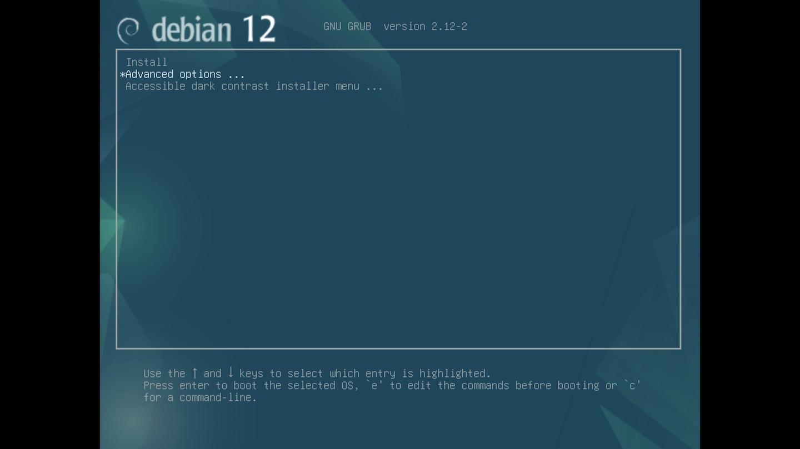
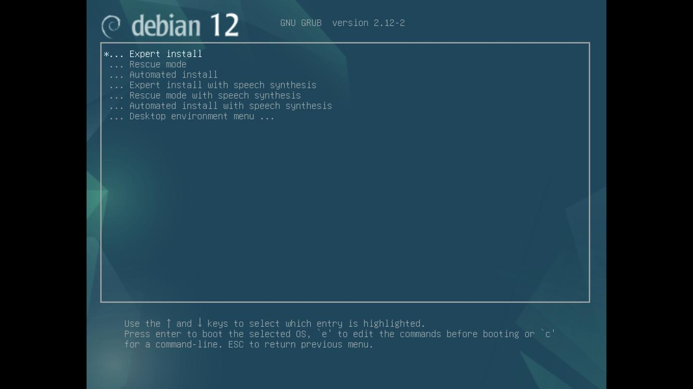
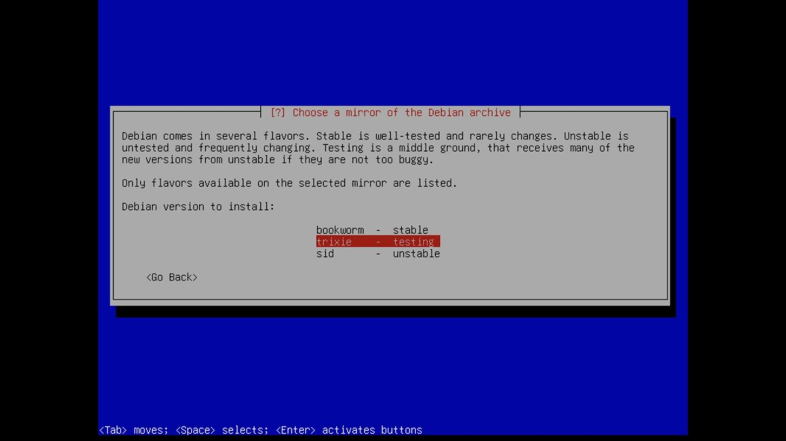

## Debian Gnome Minimal Install Guide


A minimal installation of Linux can reduce disk space and RAM usage, increase security and privacy by reducing attack surface. Increase performance by reducing time spent upgrading and troubleshooting.

The standard Debian installation process for Gnome desktop includes additional packages that may not be necessary or wanted by many users. This guide will allow you to install a minimal Gnome desktop, adding additional packages as needed.

## Requirements

* A debian installation (hardware or virtual machine) with appropriate video drivers.
* sudo privileges to install packages and run optional scripts.
* Installation of `git` to clone this repo `sudo pkg install git`
* Installation of `bash` to run install script `sudo pkg install bash`

## ISO for Installing Debian

* [debian-12.5.0-amd64-netinst.iso](https://cdimage.debian.org/debian-cd/current/amd64/iso-cd/debian-12.5.0-amd64-netinst.iso)
* [Installing Debian 12.5](https://www.debian.org/releases/bookworm/debian-installer/)
* [Debian “bookworm” Release Information](https://www.debian.org/releases/bookworm/)

## Installing Debian without a desktop environment

As you progress through the debian installation, towards the end you will be presented with the following screen for Software selection:


Uncheck **Debian desktop environment** to install a minimal debian system.

## Optional: update sources to trixie (testing) or sid (unstable)

Update sources to `trixie`. The current testing branch.

`sudo $EDITOR /etc/apt/sources`:

```bash
deb http://deb.debian.org/debian trixie main non-free-firmware
deb-src http://deb.debian.org/debian trixie main non-free-firmware

deb http://deb.debian.org/debian-security/ trixie-security main
deb-src http://deb.debian.org/debian-security/ trixie-security main

deb http://deb.debian.org/debian trixie-updates main
deb-src http://deb.debian.org/debian trixie-updates main

# deb http://deb.debian.org/debian trixie-backports main
# deb-src http://deb.debian.org/debian trixie-backports main
```

Add `non-free-firmware` after each `main` entry if you need special drivers or additional firmware.

The other option would be debian `sid` (unstable). Update `sources` as follows:

```bash
deb http://deb.debian.org/debian/ unstable main non-free-firmware
deb-src http://deb.debian.org/debian/ unstable main non-free-firmware
```

Upgrade your system:

```bash
sudo apt update && apt upgrade
```

Reboot to load updated kernel and services.

## Install Minimal Gnome

Install `gnome-shell` and reboot for a basic gnome desktop environment.

```sudo apt install gnome-shell```

As this point you can add required packages as needed.

It is likely that you will want additional packages. So you can use the following script to help automate the install.

```bash
# clone the repo
git clone https://github.com/coonrad/Debian-Gnome-Minimal-Install.git
# cd to repo
cd Debian-Gnome-Minimal-Install
# edit install-debian to reflect your desired packages
# run install script and call the gnome function or other functions
./install-debian gnome
reboot
```

The script will take the command line argument (in this case 'gnome') and match it to the function to install the selected gnome related packages. (It also verifies you are running Debian before doing anyhting.) You can add or subtract packages to suit your needs.

```bash
#!/usr/bin/env bash

set -e

gnome() {
    sudo apt install -y \
        eog \
        evince \
        gnome-calculator \
        gnome-disk-utility \
        gnome-screenshot \
        gnome-session \
        gnome-shell-extensions \
        gnome-system-monitor \
        gnome-terminal \
        gnome-tweaks \
        nautilus \
        nautilus-wipe \
        network-manager-gnome \
        network-manager-openvpn \
        network-manager-openvpn-gnome \
        wl-clipboard \
        xsel
}

apps() {
    sudo apt install -y \
        firefox \
        keepassxc \
        inkscape
}

base() {
    sudo apt install -y \
        git \
        rsync \
        sudo \
        tcpdump
}

if [[ $(uname) == 'Linux' ]]; then
    if [ "$(/bin/grep ^ID= /etc/os-release)" = "ID=debian" ]; then
        "$@" && echo
    fi
fi
```

## Install directly to testing or unstable with the mini.iso

If you are installing with the standard debian installer, but would like to set your sources to testing or unstable. You will need to complete the install, reboot, update the sources, and then upgrade all packages to the new sources. You can skip this step and install directly to testing or unstable with the mini.iso.

- [mini.iso](https://d-i.debian.org/daily-images/amd64/daily/netboot/)
- [mini.iso SHA256SUMS](https://d-i.debian.org/daily-images/amd64/daily/SHA256SUMS)

Note: The mini.iso is built daily. There are times when the build wasn't completed or not available for some reason.



Upon booting the mini.iso select "Advanced options".



Then select "Expert install".

As you progress through the installation steps you will be given the option to select the mirror of the debian archive.



